# YoRHa Rainmeter Telemetry Suite

A *NieR:Automata* YoRHa-themed telemetry and system monitoring skin suite for [Rainmeter](https://www.rainmeter.net/).

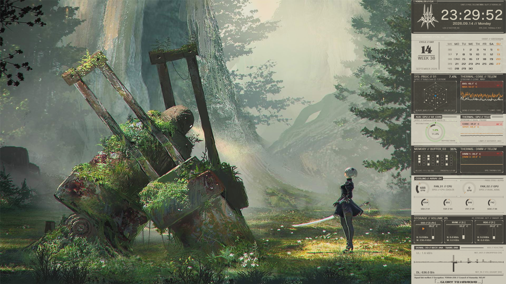

<p align="center">
  
</p>

## Features

- **Full Telemetry Suite**:
  - **Clock**: Digital military clock with date display and YoRHa interface accents.
  - **Weather HUD**: 24-hour meteorological chrono-telemetry and conditions (click Clock to toggle).
  - **Calendar**: Clean monthly calendar with Lua-powered grid calculations and ISO week indicators.
  - **Lunar HUD**: Astronomical solar ecliptic and lunar phase cycle telemetry (click Calendar to toggle).
  - **CPU**: Multi-core telemetry, frequency metrics, load graphs, and temperature monitoring.
  - **GPU**: Core load, VRAM utilization, clocks, and thermal tracking.
  - **RAM**: Memory usage statistics and active swap/pagefile telemetry.
  - **Disks**: Drive space indicators, activity meters, and storage diagnostics.
  - **Fans**: Real-time RPM tachometer gauges and cooling duty cycles.
  - **Network**: Real-time up/down bandwidth throughput gauges and IP status.
- **Dual Visual Themes**:
  - **Light Theme**: Authentic NieR:Automata sand-paper matte styling, smoky glass textures, dark tape banners, and horizon guideline accents.
  - **Dark Theme**: High-contrast tactical night HUD with translucent panels and muted bronze/gold tones.
- **Modular Widgets**: Individual draggable widgets for each telemetry module (`Clock`, `Calendar`, `CPU`, `GPU`, `RAM`, `Fans`, `Disks`, `Network`).
- **Profile Switcher** (`Set-Profile.ps1`):
  - Switch between `Light`, `Dark`, and `Interleaved` alternating themes across modules with a single command.

---

## Module Showcase

### Clock & Weather HUD
*Click anywhere on the widget or top badge to toggle between Clock and Weather modes.*

| System Clock | Weather Telemetry HUD |
| :---: | :---: |
| 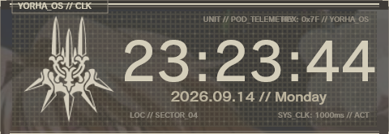 | 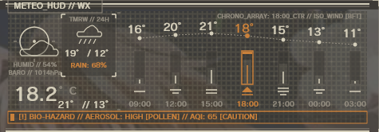 |
| *Digital military clock with date & tactical accents* | *24-hour meteorological chrono-telemetry HUD* |

### Tactical Calendar
*Click anywhere on the widget to toggle between Gregorian matrix and Astronomical Lunar views.*

| Gregorian Calendar | Lunar / Orbit Telemetry |
| :---: | :---: |
| 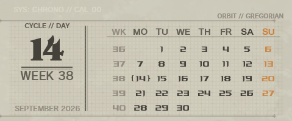 | 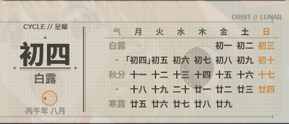 |
| *Monthly calendar grid with ISO week numbers* | *Astronomical solar orbit & lunar phases* |

### Processor Telemetry

| CPU Telemetry | GPU Telemetry |
| :---: | :---: |
| 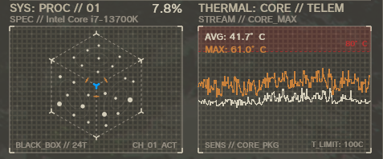 | 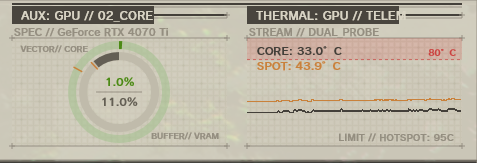 |
| *Multi-core load graphs, frequencies & thermals* | *Core load, VRAM utilization, clocks & thermals* |

### Memory & Storage

| RAM / Memory | Disks & Storage |
| :---: | :---: |
| 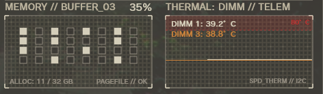 | 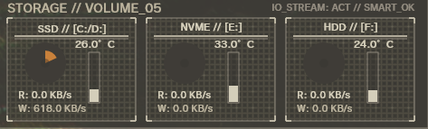 |
| *Physical RAM allocation & active swap metrics* | *Drive capacity indicators, free space & activity* |

### Cooling & Network

| Fans & Cooling | Network I/O |
| :---: | :---: |
| 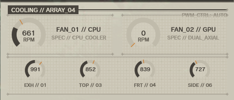 | 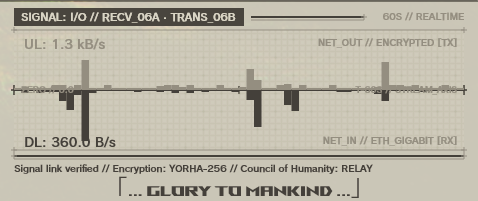 |
| *Real-time RPM tachometers & duty cycles* | *Real-time up/down bandwidth gauges & traffic* |

---

## Requirements & Fonts

The skin uses community aliases for its typography hierarchy:

### Community Fonts
- **`YorHa Gothic`** (Primary UI, headers & tactical telemetry readouts)
- **`YorHa Mincho`** (Calendar grids & secondary telemetry)
- **`YorHa Serif`** (Clock & calendar serif numerals)

*(Font files are not bundled in this repo. Place your fonts in `@Resources/Fonts` or install them in Windows).*

### Free Open-Source Drop-in Alternatives
You can also use 100% free and open-source Google Fonts (SIL Open Font License):
- **Headers & Tactical**: **[Zen Kaku Gothic New](https://fonts.google.com/specimen/Zen+Kaku+Gothic+New)** or **[Noto Sans JP](https://fonts.google.com/specimen/Noto+Sans+JP)**
- **Secondary & Calendar**: **[Zen Antique Soft](https://fonts.google.com/specimen/Zen+Antique+Soft)** or **[M PLUS 1p](https://fonts.google.com/specimen/M+PLUS+1p)**
- **Numerals & Serifs**: **[Cinzel](https://fonts.google.com/specimen/Cinzel)** or **[Grenze](https://fonts.google.com/specimen/Grenze)**

You can configure active font families at any time in `@Resources/Variables-Light.inc / Variables-Dark.inc` (`#FontHeader#` and `#FontClockNum#`).

---

## Quick Start & Usage

1. Clone or extract this repository into your Rainmeter skins directory:
   ```powershell
   git clone https://github.com/naimen/rainmeter-yorha-telemetry.git "Documents\Rainmeter\Skins\YorHa"
   ```
2. Ensure the required fonts are installed in Windows (or placed in `@Resources\Fonts`).
3. Open Rainmeter, refresh skins, and load the desired widgets (`CPU\CPU.ini`, `Clock\Clock.ini`, etc.).

### Switching Themes

Run the PowerShell profile switcher to toggle themes:
```powershell
# Interleaved alternating profile (default)
.\Set-Profile.ps1 -Profile Interleaved

# Full Dark theme
.\Set-Profile.ps1 -Profile Dark

# Full Light theme
.\Set-Profile.ps1 -Profile Light
```

## Author

- **naimen** ([@naimen](https://github.com/naimen))